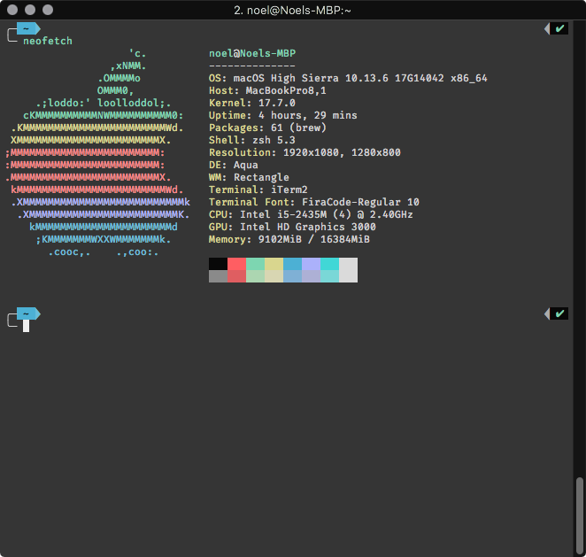
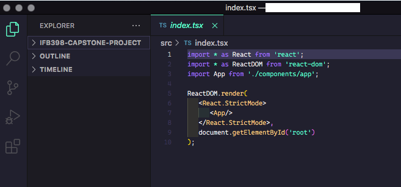

# Code environment setup for my macOS machine 

## Screenshots:

## Terminal
- Terminal Emulator: iTerm2
- Shell: Zsh (with Oh-My-Zsh) 
- Terminal Font: Fira Code Regular (10pt)
- Terminal Text-Editor: Vim

## VS Code
- Font: Cascadia Code Light (10.5pt)
- Theme: Aura Soft Dark
- Extensions: [Aura Theme, Bracket Pair Colorizer, Indent-Rainbow, Prettier Formatter, VSCodeVim]
